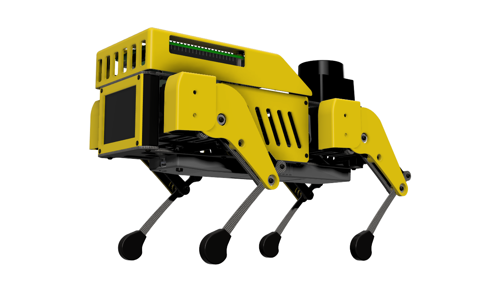
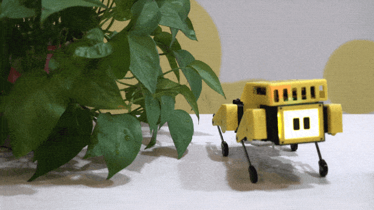
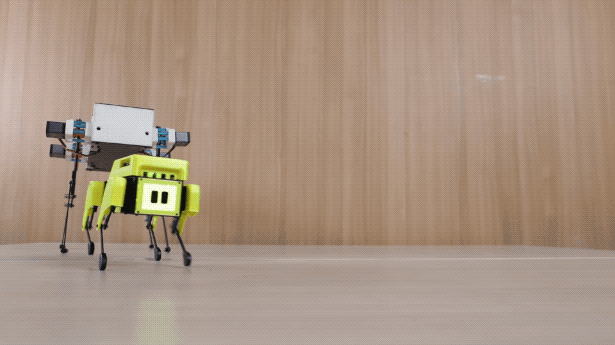
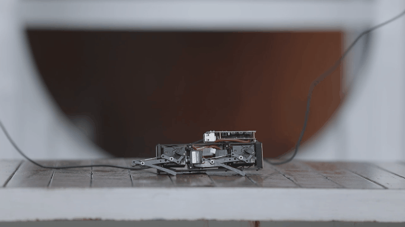
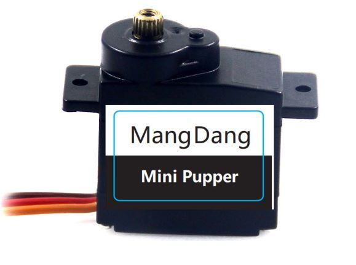
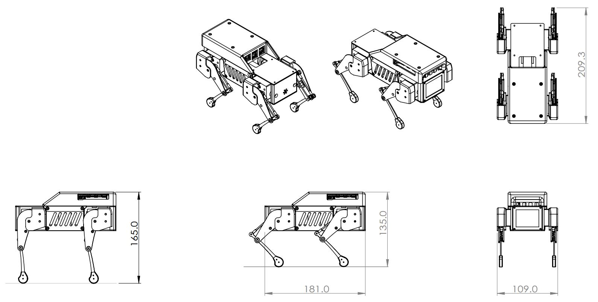

# Mini Pupper - ROS, OpenCV, Open-source, Pi Robot Dog
Mini Pupper will make robotics easier for schools, homeschool families, enthusiasts and beyond.

ROS: support ROS SLAM&Navigation robot dog at low-cost price, endorsed by ROS.

OpenCV: support OpenCV official 3D module.

Open-source: DIY and custom what you want, won a HackadayPrize!

Pi: it’s super expandable.

## Background
You maybe see many demos from Boston Dynamics Spot Mini, and so on, many guys want to own their own robot dog to explore the functions, but the price is too high to accept, and it is not easy to explore the robot dog features.

TurtleBot is very convenient for wheeled robot study, but not legged robots. That means, there is no ROS, open-source robot dog platform to study at less than $1,000USD.

Beginning 2020, as Stanford Pupper vendor, we shipped many Stanford Pupper units worldwide. After such global success with Pupper, we took to heart all the feedback from this endeavor. What do our customers want in our products? What kind of products do they like? After more than 11 months pursuing these requests, we would like to show you what we came up with. Mini Pupper!

## Solution and Product
Mini Pupper is the ROS, open-source robot dog platform that supports ROS SLAM, Navigation, and OpenCV AI features with Lidar, camera sensors. It's really a Boston Dynamics Spot Robot Dog in the Palm and legged "TurtleBot"  for study at less than $500USD. 

Mini Pupper will make robotics easier for schools, homeschool families, enthusiasts, and beyond.

The project is generously supported by [Nathan Kau](https://github.com/stanfordroboticsclub/StanfordQuadruped), a member of [Stanford Student Robotics](https://stanfordstudentrobotics.org/), and [MangDang Technology Co., Limited](https://www.mangdang.net/)

## Design
Our Mini Pupper servo is a custom servo to meet the requirements of our new Pupper! Compact, Durable, Unique. To run the Mini Pupper organically and smoothly, high torque & high-fidelity servos were required. We tested many servos on the market and have not found any 9g servo up to the task. After too many Q.C issues we finally gave up on off-the-shelf hobbyist servos, the last thing we want is for our intelligent customers to be let down by poor quality servos. So, we spent several months optimizing and configuring a servo that would work for our project, including tuning the servo parameters ourselves! It is now named Mini Pupper servo.

## Explore the Gait Performances
You can use our Mini Pupper to explore many gait performances, such as Trot (diagonal pairs), Pace (lateral pairs), and the Bound (front and rear pairs). We’re confident our Mini Pupper Servos will outperform any servo for the balance of performance and price.

## The Mechanical Design
The mechanical design is simple, stable, and beautiful. You can find many prototype quadruped robots, but few can go to market because of their complex design! Difficult to assemble, lack stability while trotting, and require unpredictable costly repairs. For the average engineering student or extremely curious individual these quadrupeds will work, however, they are not suitable for mass production. The Mini Pupper addresses these issues by creating a professional robot designed specifically for mass production, driving unit costs low enough for even low-budget schools to acquire the robots for learning. Driving innovation for the next generation of robotics enthusiasts. Unlike other 3D printed robots, we use metal threaded inserts to ensure customers can disassemble and reassemble easily while making repairs after extensive use. All parts are secured with quality fasteners ensuring great fit and function as well as durability of the unit. Cleaner builds were achieved by customizing the servo cable length and integrating the IMU into our carry board to reduce the wiring necessary and have an overall clean setup in the body of Mini Pupper. No lose wires! Unlike other enthusiast-made kits, our Mini Pupper does not require the user to plug or unplug wires to power the unit on and off. A simple flick of a switch is all you need! The Mini Pupper battery is charged without the need to remove the battery from the robot, onboard voltmeters will sound alarm and warn you that your unit needs energy. Mini Pupper's design was based on the feedback we received from our existing customers. Because of this we now have a quadruped robot easier to set up and play with than any other robot on the market. Customers with minimal or no experience will be able to use this robot.

The Mini Pupper has 12 DOF (degree of freedom), unlike the 8 DOF available through similar projects. There was a lot of debate within our team about whether we should keep with norms and produce the same 8 DOF. After much debate, we concluded 8 DOF robots lack the ability to follow natural biological movements. The benefits of an 8 DOF quadruped only seemed to benefit the producer as the cost of the robot and parts required would be less. But we would have lost the original inspiration of the project… Which was to provide our customers with the highest quality best performing robot in this price range. All the servos are controlled one by one by a PCA9685. The gait performance is dependent on the 12 servos control loop time, requiring more effort to optimize 12 DOF vs 8DOF. There were doubts we could accomplish this with such a low price point. Although it was a challenge, after several months Mini Pupper is the first consumer 12 DOF quadruped robot in the world with a mass production intention.

## The HMI (Human-Machine-Interface)
The HMI (Human-Machine-Interface) LCD is another wonderful function. Taking Mini Pupper from a bunch of screws and motors, an animalistic appearance is given to Mini Pupper. You can communicate with it, you can customize it. Mini Pupper is the first consumer quadruped robot with LCD’s adding animal behaviors to your robot.

## Education Courses
We are targeting Mini Pupper for education. Education courses are also coming. To make the study of Mini Pupper easy and convenient, the courses will be released step by step, including mechanical, hardware, ROS, SLAM, navigation, AI functions, and so on. If you’ve been searching for an open-sourced consumer-grade quadruped research robot, Mini Pupper is the best platform for you.
We are inviting 10 professional hackers worldwide to prepare the courses. It will be unlike anything that you've ever seen before. 

## How to Work Smart
The main software improvement from Pupper is our FSN (Full Self-Navigation) system, based on Ubuntu&ROS and OpenCV. We are moving forward to the FSN target step by step. The interface is also open, we absolutely welcome people to contribute to the project. If you want to join us and move together with us, please don't hesitate to send us an email!

## How to Build 
To get started, check out the pages linked below on part sourcing and assembly.  
- BOM list: https://drive.google.com/file/d/18phJat8GdK5Yq5p4K1ZmfY1-nMf1lQw4/view?usp=sharing
- Fusion 360 CAD model: https://a360.co/3fS15a1
- Assembly Instructions

   [Legs Assembly](https://github.com/mangdangroboticsclub/QuadrupedRobot/blob/MiniPupper/Doc/guide/Assembly.Legs.rst)

   [Hips Assembly](https://github.com/mangdangroboticsclub/QuadrupedRobot/blob/MiniPupper/Doc/guide/Assembly.Hips.rst)

   [BodyFrames Assembly](https://github.com/mangdangroboticsclub/QuadrupedRobot/blob/MiniPupper/Doc/guide/Assembly.BodyFrame.rst)

   [FunctionComponents Assembly](https://github.com/mangdangroboticsclub/QuadrupedRobot/blob/MiniPupper/Doc/guide/Assembly.FunctionComponent.rst)

   [Covers Assembly](https://github.com/mangdangroboticsclub/QuadrupedRobot/blob/MiniPupper/Doc/guide/Assembly.Cover.rst)

   [Calibration](https://github.com/mangdangroboticsclub/QuadrupedRobot/blob/MiniPupper/Doc/guide/Calibration.rst)  [Calibration video](https://youtu.be/oMQS_zwIw40)

- [Software Installation](https://github.com/mangdangroboticsclub/QuadrupedRobot/blob/MiniPupper/Doc/guide/software_installation.rst) 

- [Robot operation(same with pupper](https://pupper.readthedocs.io/en/latest/guide/operation.html)

## How to Purchase 
If you purchase the parts yourself one by one, it’ll run you about $800 and more time. However, you can purchase a kit to build the robot from MangDang channel for cheaper and one-stop shopping. 
- [Kickstarter Crowdfunding Campaign](https://www.kickstarter.com/projects/336477435/mini-pupper-open-sourceros-robot-dog-kit)
- [Indiegogo Crowdfunding Campaign](https://www.indiegogo.com/projects/mini-pupper-open-source-ros-robot-dog-kit/)
- [Makuake Crowdfunding Campaign](https://www.makuake.com/project/mini_pupper/)
- Amazon channel: [Mini Pupper Amazon US](https://www.amazon.com/s?me=A3V5171RNQ5C18&marketplaceID=ATVPDKIKX0DER) , [Mini Pupper Amazon Japan will open after Makuake close](https://www.amazon.co.jp/s?me=A14LOTMOI42BRX&marketplaceID=A1VC38T7YXB528)
- Paypal channel: MangDang Paypal account is afreez.gan@gmail.com
- Aliexpress channel: [Mini Pupper Aliexpress](https://www.aliexpress.com/store/911381222?spm=a2g0o.detail.1000007.1.2ed464e6sdYBwy)

## About Stanford Student Robotics
[Stanford Student Robotics](https://stanfordstudentrobotics.org/) is an entirely student-run group dedicated to building cool robots and learning new things. You can find many amazing projects on the website. Mini Pupper project is supported by [Nathan Kau](https://github.com/stanfordroboticsclub/StanfordQuadruped) from Stanford Student Robotics.

## About MangDang Technology Co., Limited
Founded in 2020, [MangDang Technology Co., Limited](https://www.mangdang.net/) (MangDang) specializes in the research, development, and production of robot products that make peoples lives better. Mangdang is headquartered in HongKong, with R&D offices in Beijing. We are a global team with members from many countries and regions such as the United States, Japan, Canada, Europe, China and so on.
- Mission: Using AI to make life better.
- Vision: Every home, every one can use our robot product to make life better.

We are all dreamers, we look forward to connecting talents worldwide and innovating together to perform splendid times! 
- For business, you can connect us by mail(sales@mangdang.net).
- Beijing Office address: Innostyle, Building 5, No.36 Haidian West Street, Haidian District, Beijing, China.
- Our online channel: [Youtube](https://www.youtube.com/channel/UCqHWYGXmnoO7VWHmENje3ug/featured), [Twitter](https://twitter.com/LeggedRobot), [FaceBook](https://www.facebook.com/afreez.gan/) 
